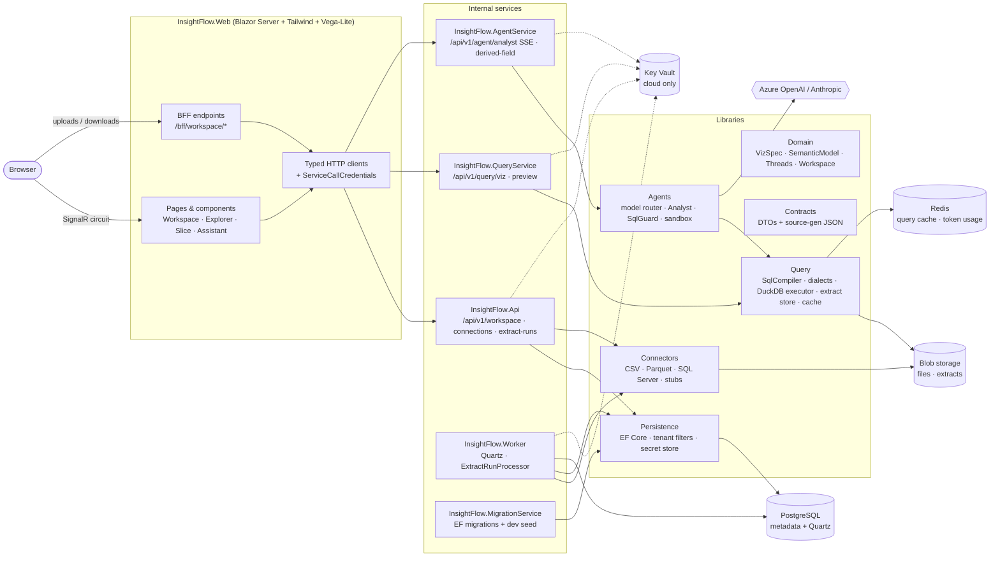
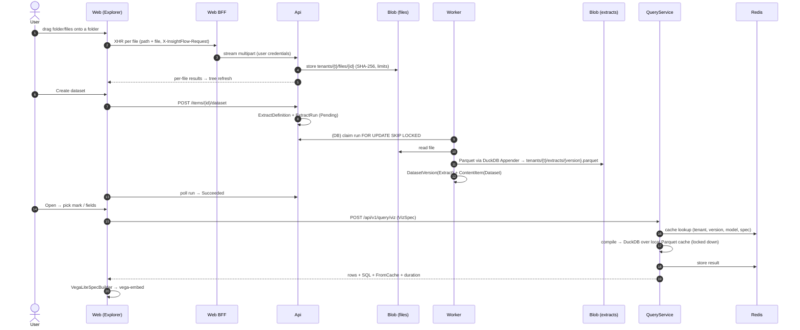
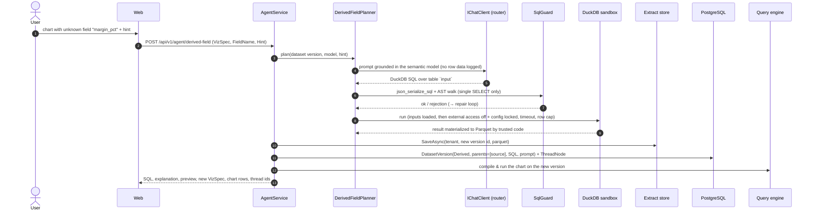
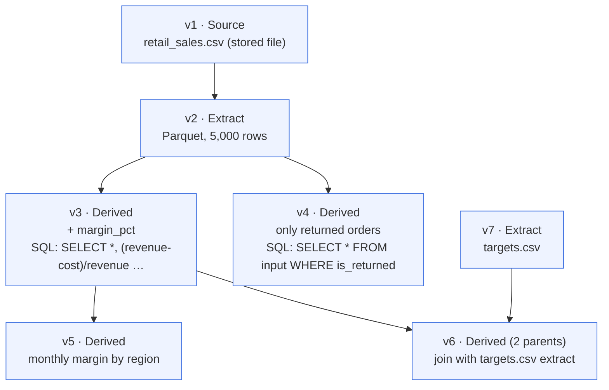
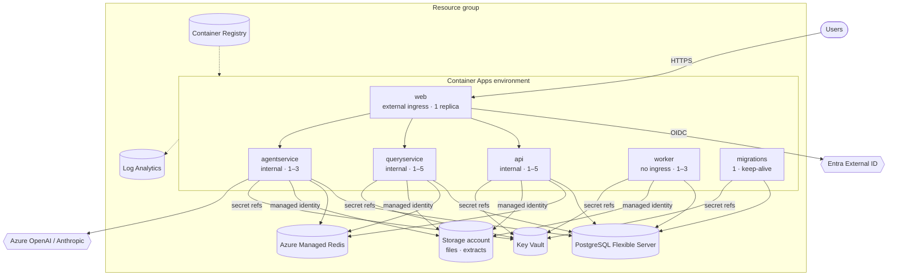

# Insight Flow architecture

Insight Flow is a multi-tenant SaaS analytics product. Users drop files into a workspace, turn them into datasets
(Parquet extracts), and explore by picking fields or by asking in plain English. Every chart is a `VizSpec`, compiled
to DuckDB SQL by our own compiler. The AI writes DuckDB SQL only, and it runs only in a locked-down sandbox.

Decisions and their reasons are in [docs/adr](adr/README.md). This page shows how the pieces fit together.

## Components

**Dependency rules** (enforced by `tests/InsightFlow.Architecture.Tests`):

- Domain → nothing.
- Contracts → Domain.
- Persistence → Domain.
- Query → Domain, Contracts.
- Agents → Domain, Contracts, Query.
- Connectors → Domain, Contracts.
- Service hosts → their library + Persistence + ServiceDefaults.
- Web → Contracts + ServiceDefaults only, using only `InsightFlow.Domain.Viz` types.
- AI SDKs live only in Agents, DB drivers only in Connectors, UI/JS assets only in Web.

| Component | Responsibility |
|---|---|
| **AppHost** | Declares every resource. Containers/emulators locally; Azure resources when published (ADR 0003, 0004) |
| **ServiceDefaults** | OpenTelemetry, health checks, resilience, service discovery, authentication + tenant + policies |
| **Domain** | Pure model and rules: `VizSpec` + validator, semantic model, dataset-version DAG, workspace tree rules, `TenantId` |
| **Contracts** | HTTP DTOs with a source-generated `ContractsJsonContext` |
| **Persistence** | `InsightFlowDbContext` with `tenant` and `soft_delete` filters, a write guard, migrations, `ISecretStore` |
| **Query / QueryService** | VizSpec → SQL, DuckDB execution over cached Parquet, Redis result cache |
| **Agents / AgentService** | Model router + middleware, Analyst agent and tools, derived-field planner, SQL guard + sandbox, SSE |
| **Connectors** | Source connectors writing Parquet through the DuckDB Appender; extract pipeline |
| **Api** | Workspace Explorer (folders, uploads, downloads, create dataset), connections, extract runs |
| **Worker** | Quartz (clustered, PostgreSQL store); claims and runs queued extract runs |
| **MigrationService** | Applies migrations once; seeds Contoso Retail in Development |
| **Web** | Tailwind UI, Vega-Lite rendering, BFF proxy for files, typed clients to the services |

## Vertical slice: drop a file → chart

## Derived-field flow ("drop a field that doesn't exist yet")

The **Analyst** (`POST /api/v1/agent/analyst`) uses the same pieces as tools (`DescribeModel`, `RunSql`,
`ProposeChart`) and streams `text`, `tool`, `sql` (with preview), `chart`, `error` and `done` events over SSE.

## Data Thread DAG example

Dataset versions are immutable. A thread is a path through the DAG, and any node can be branched.

Each `ThreadNode` points at a version and stores the saved `VizSpec`(s) and the agent's explanation.
`LineageGraph` answers "where did this come from?" by walking `ParentIds`.

## Deployment on Azure Container Apps

Built with `aspire publish` / `aspire deploy`; see [deploy.md](deploy.md). Postgres and Redis use password and access-key
auth through Key Vault for now (ADR 0023).

## Cross-cutting concerns

- **Tenancy:**
  - The tenant comes from the token claim.
  - EF applies the `tenant` filter, and `SaveChanges` checks writes.
  - Blob paths are prefixed per tenant, and every endpoint loads data in the caller's tenant.
  - Tests: `TenantIsolationTests` plus the cross-tenant checks in the workspace, query and agent tests.
- **Security:**
  - The fallback policy requires a tenant, and the role policies are defined in one place.
  - The development auth handler works only in Development.
  - The AI's SQL runs only through `ISqlSandbox`, and secrets are only ever held as references.
- **Observability:**
  - ServiceDefaults registers the `InsightFlow.*` activity sources and meters, so traces show compile → execute → cache and agent tool calls.
  - Logs carry ids, counts, durations and token usage — never row data, prompts with data, or credentials.
- **Performance:** about 10 µs to compile; 166–197 ms for group-bys over 10M rows on a laptop ([benchmarks.md](benchmarks.md)).
  Results are cached in Redis, keyed by spec + version + model.
